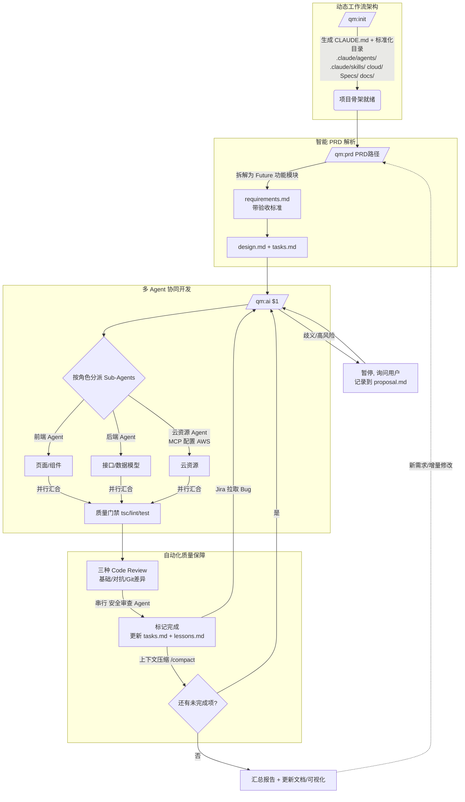
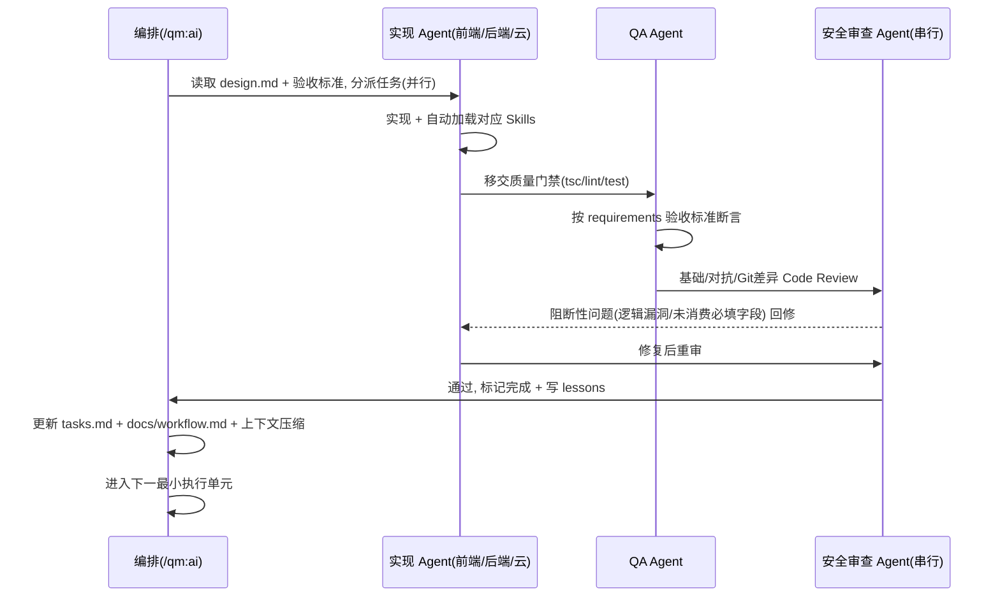

你将以"多 Agent 协同自动开发"模式驱动项目，串联 `/qm:init`（初始化/规范）与 `/qm:prd`（需求拆解）的产出，按下列全局规则自动循环执行开发任务，直到完成或遇到需要用户决策的节点。本命令体现两大支柱：**多 Agent 协同开发**（前端/后端/QA 等角色作为独立 Sub-Agents 运行，并行任务自动加载对应 Skills 工具集，安全审查等环节保持串行）与**自动化质量保障**（三种 Code Review 模式、逻辑漏洞检测、Jira Bug 拉取、上下文压缩控制 Token）。

## 设计模式

本命令遵循 [Google ADK · 5 种 Agent Skill 设计模式](https://x.com/GoogleCloudTech/status/2033953579824758855) 中的 **Pipeline（流水线）** 模式，并组合 **Reviewer**、**Tool Wrapper** 与 **Inversion**：

- **Pipeline（主）**：每个最小执行单元都走"实现 → 质量门禁 → Code Review → 标记完成"的**严格多步流水线**，步骤间设**校验门禁**（"仅当上一步通过才进入下一步"），不允许跳步交付未经验证的产物（见第一步 1.4 与第二步）。
- **Reviewer（组合）**：三种 Code Review 模式（基础 / 对抗 / Git 差异）即 Reviewer 模式——按清单逐项评审、按严重度分组（阻断性 / 非阻断性），阻断项未清零不放行（见 2.1）。
- **Tool Wrapper（组合）**：各角色 Sub-Agent 按任务类型**按需加载**对应 Skills 工具集（设计稿还原、Drizzle/zod、Vitest 等），即 `/qm:init` 在 `.claude/skills/` 中封装的技术栈参考知识（见 1.1）。
- **Inversion（组合）**：命中"高风险操作"（全局规则 6）或"歧义不猜"（全局规则 8）时，流水线**暂停并反向访谈用户**，确认后才继续。

参数 `$1`：任务来源，可以是 PRD 文件路径、`Specs/` 下某需求子目录（如 `Specs/<主题>/`）、或留空（此时自动扫描 `Specs/` 下所有子目录，找出 `tasks.md` 中存在未完成任务/子任务的需求目录）。

## 第〇步：状态检查

1. 检查项目根目录是否存在 `CLAUDE.md`：
   - 不存在 → 提示用户先运行 `/qm:init`，并停止
2. 确定本轮要执行的需求目录 `Specs/<主题>/`：
   - `$1` 是 PRD 路径且 `Specs/<主题>/` 不存在 → 调用 `/qm:prd $1` 的第〇~二步逻辑，生成 `requirements.md`/`proposal.md`/`design.md`/`tasks.md` 后再继续
   - `$1` 是 `Specs/<主题>/` 路径，或留空时扫描到的需求目录 → 读取该目录下的 `requirements.md`、`proposal.md`、`design.md`、`tasks.md`、`lessons.md`（若存在）
   - 留空且 `Specs/` 下没有任何含未完成任务的目录 → 提示用户运行 `/qm:prd <prd-path>` 先拆解任务，并停止
3. 用 `TodoWrite` 同步 `tasks.md` 中未完成的任务/子任务，作为本轮执行队列
4. 读取 `.claude/agents/`（Subagent 人格文件）与 `cloud/`（云资源声明）；若不存在，按"全局规则 11"在首次运行时按 `/qm:init` §2.2.1 初始化默认 subagent 与资源占位

## 全局规则（适用于本命令及 /qm:init、/qm:prd 全流程）

这些规则优先级高于具体任务描述，任何阶段冲突时以此为准：

1. **规范来源唯一**：所有代码风格、目录结构、API 格式、命名规范以 `CLAUDE.md` 为准；验收标准以 `requirements.md` 为准；设计细节以 `design.md` 为准。若任务要求与之冲突，先暂停并向用户确认是更新规范/设计还是调整任务。
2. **最小执行单元**：以 `tasks.md` 中没有子任务的任务、或某个子任务为最小执行单元；存在子任务的父任务不直接执行，按子任务顺序逐个完成，全部完成后父任务状态自动汇总为已完成。若执行中发现任务粒度过大，按 `/qm:prd` 第 2.6 节规则拆分为子任务后再继续。
3. **小步提交**：每完成一个最小执行单元，依次执行质量门禁与代码评审（见下），通过后再进入下一项；不要把多个不相关任务的改动混在一起。
4. **质量门禁**：每个最小执行单元完成后必须执行（若项目已配置）：
   - 类型检查（`tsc --noEmit` 或等价命令）
   - Lint（Biome/ESLint）
   - 单元测试（若该模块有测试），断言以 `requirements.md` 的验收标准为依据
   未通过则先修复，不得带着失败状态进入下一项。
5. **三种 Code Review 模式**：质量门禁通过后，对本次改动的 `git diff` 执行代码评审（详见"第二步：自动化质量保障"），阻断性问题修复后重审，非阻断性建议记录到 `lessons.md`。评审工具不可用时向用户说明并询问是否跳过。
6. **高风险操作必须暂停确认（Inversion Gate）**，不可自动执行——暂停并反向访谈用户确认后才继续：
   - 数据库迁移的实际执行（`drizzle-kit push`/`migrate` 等），只生成迁移文件
   - 删除文件/目录、`git push`、`npm install` 联网安装依赖
   - 通过 MCP 实际创建/变更云资源（AWS 等），需用户确认后执行
   - 涉及第三方支付、保司接口、短信等的真实调用（默认用 mock/沙箱）
7. **敏感数据**：身份证号、银行卡号、手机号等 PII，禁止写入日志、测试 fixture 使用脱敏假数据（标注为 mock）。
8. **歧义不猜（Inversion Gate）**：业务规则、存储方案、状态机等若 PRD/`proposal.md` 未明确，必须停下来**反向访谈用户**，记录到 `proposal.md` 的"待澄清问题"，不得自行假设。
9. **保持同步**：若实现过程中发现 `CLAUDE.md` 规范过时/缺失，或 `design.md`/`requirements.md` 与实现不一致，在完成该最小执行单元后更新对应文档。
10. **状态持久化 + 上下文压缩**：每个最小执行单元完成后，同步更新 `tasks.md` 状态（含父任务汇总）、`TodoWrite`，并将经验教训写入 `lessons.md`——这是支持后续 `/compact`/`/clear` 续接的基础，也是上下文压缩控制 Token 消耗的前提。
11. **多 Agent 协同**：按角色将工作分派给独立 Sub-Agents（详见"第一步"），并行任务自动加载对应 Skills 工具集；安全审查、数据库迁移等高风险环节保持**串行**以保证流程可控。
12. **实时状态播报（派发/执行前后必须双写）**：**派发或执行任何任务/子任务/阶段的前后都必须更新工作流状态**，不得只在中途更新一次：
    - **派发/开始前**：先写一次状态——把该最小执行单元与承担角色标记为「进行中」（`stage` 标注当前将进入的阶段，如「派发」「实现」），再真正动手；
    - **完成/移交后**：再写一次状态——把该单元/角色标记为「已完成」（或移交给下一角色时更新为对方「进行中」），并刷新 `tasksSummary` 的 `done/total/blocked`；
    - **阶段切换时**（实现 → 质量门禁 → Code Review 等）同样在进入新阶段前与离开旧阶段后各更新一次。

    每次更新都要同时做两件事：①向用户输出一行状态播报，格式：`[<Sub-Agent角色>] 任务<编号> <任务名> · <阶段编号 阶段名> · <状态>`，多个 Sub-Agent 并行时各自播报各自的状态行；②覆盖写 `Specs/<主题>/.qm-status.json`（结构见"工作流可视化"一节）。这样 `/qm:status` 在任意时刻读取到的都是最新的「派发前 / 执行中 / 完成后」状态。`docs/workflow.html`/`docs/office.html` 作为回顾快照在每轮结束后一并刷新，不替代上述实时双写。

## 第一步：多 Agent 协同执行

### 1.1 角色（Subagents）与 Skills 加载（Subagent + Tool Wrapper）

> **Subagent 模式**：每个角色是 `/qm:init` 在 `.claude/agents/<agentKey>.md` 生成的**独立 Claude Code subagent**（人格文件，格式见 `/qm:init` §2.2.1，参考 [wshobson/agents](https://github.com/wshobson/agents)）。`/qm:ai` 用 `Task` 工具按 `subagent_type=<agentKey>` **真正委派**；每个 subagent 文件已封装该专家「怎么想 / 懂什么 / 不该干什么」。
> **Tool Wrapper 模式**：下表"加载的 Skills/工具"列即各角色的 Tool Wrapper——`/qm:init` 在 `.claude/skills/` 封装的按需加载参考知识，subagent 执行任务时按需加载，即刻成为该领域专家，而非把所有规范塞进单条 prompt。

下列 `agentKey` 与 `.qm-status.json`、`docs/office.html` 工位**一一对应**（共 8 个）。`orchestrator` 是 `/qm:ai` 本体（编排者），负责拆队列/分派/编排/状态双写，**不是被委派的 subagent**；其余 7 个为可委派 subagent，首次运行若 `.claude/agents/` 缺失则按 `/qm:init` §2.2.1 创建默认版本：

| agentKey | 角色 | 懂什么（职责 / 任务类型） | 不该干什么（边界） | 加载的 Skills/工具 |
|----------|------|--------------------------|--------------------|--------------------|
| `orchestrator` | 编排者（/qm:ai 本体） | 拆队列、分派、串/并行编排、状态双写 | 不亲自写业务代码；不跳过任何门禁 | — |
| `product` | 产品 Agent | 需求澄清、验收标准核对 | 歧义不猜，反向访谈用户 | `requirements.md` |
| `design` | 设计 Agent | 设计稿还原、像素级验证 | 不改后端 / 共享契约 | 设计稿还原（ui-design-restore / stitch / ui_diff_check）、Playwright |
| `frontend` | 前端 Agent | 页面/组件/状态/表单（前端任务） | 不直写 fetch、不碰 DB schema | 前端规范 skill、Playwright |
| `backend` | 后端 Agent | 数据模型/接口/服务/鉴权（后端、共享任务） | 不实际执行迁移，只生成迁移文件 | backend-conventions、db-conventions、Vitest |
| `qa` | QA Agent | 测试与验收标准核对（测试、验收） | 不放宽验收标准 | Vitest、Playwright、`requirements.md` 验收标准 |
| `cloud` | 云资源 Agent | 云资源声明与配置（云任务） | 不擅自创建/变更真实云资源（需确认） | MCP 协议（自动配置 AWS 等） |
| `security` | 安全审查 Agent（**串行**） | PII/鉴权/SSRF/逻辑漏洞（安全审查） | 不放行 Code Review 阻断项 | 三种 Code Review（见第二步） |

### 1.2 并行与串行编排

- **可并行**：无相互依赖、属于不同角色或不同模块的最小执行单元，可分派给对应 Sub-Agent 并行执行（如前端页面与后端接口在接口契约已定时并行）
- **必须串行**：安全审查、数据库迁移、云资源变更、以及存在依赖关系的任务（先共享类型/数据模型 → 再后端接口 → 最后前端页面/组件）
- 并行任务各自完成后，统一进入第二步质量保障；安全审查 Agent 始终在合并前串行执行

### 1.3 云资源自动配置（MCP）

- 对涉及云资源的任务，云资源 Agent 读取 `cloud/` 中的资源声明，通过 MCP 协议自动配置 AWS 等云资源
- 实际创建/变更云资源属高风险操作，按全局规则 6 必须暂停并经用户确认后执行；仅生成/更新声明不需确认

### 1.4 单元执行循环（Pipeline · 带门禁的多步流水线）

> **Pipeline 模式**：每个最小执行单元都是一条固定顺序的流水线，**步骤间设门禁（gate）**——只有上一步达标才进入下一步，任何门禁未过都不得跳步。

对每个未完成的最小执行单元（任务或子任务），由对应 Sub-Agent 依次执行下列步骤。**每一步进入前与离开后都按全局规则 12 双写工作流状态（播报 + 覆盖写 `.qm-status.json`）**：

0. **派发前置位**：把该单元与承担角色写入 `.qm-status.json`（角色 `status: 进行中`、`stage: 派发`），同步 `TodoWrite` 该项为 `in_progress`，并播报一行状态——**先置位、后动手**
1. 读取该项的描述、依赖、`design.md` 设计内容与 `requirements.md` 验收标准，确认依赖项已完成
2. 按 `CLAUDE.md`/`design.md` 实现；发现粒度过大先拆分子任务，发现设计需调整先更新 `design.md`
3. 运行质量门禁（全局规则 4）；失败则修复后重试，连续失败 2 次则暂停并报告给用户
4. 通过后进入第二步执行三种 Code Review
5. **完成后回写**：用 `TodoWrite` 标记完成，同步更新 `tasks.md` 状态（含父任务汇总）与 `.qm-status.json`（该角色 `status: 已完成`、刷新 `tasksSummary`），将评审建议/踩坑写入 `lessons.md`，并播报一行完成状态
6. 若触发"高风险操作"或"歧义不猜"规则，暂停，用 `AskUserQuestion` 向用户确认后再继续
7. 状态已持久化，执行上下文压缩（`/compact`）或提示用户 `/clear` 后重新运行 `/qm:ai` 续接下一项

> 简记：**派发前写一次（进行中）→ 执行/阶段切换各写一次 → 完成后写一次（已完成）**，确保任意时刻 `/qm:status` 都能读到最新状态。
>
> **Pipeline 门禁（不可跳步）**：质量门禁（tsc/lint/test）未全绿 → 不进入 Code Review；Code Review 阻断项未清零 → 不标记完成；命中高风险/歧义 → 暂停反向访谈（Inversion）后再续。每道门禁未过都不得进入下一阶段。

## 第二步：自动化质量保障

### 2.1 三种 Code Review 模式（Reviewer）

> **Reviewer 模式**：每种模式都是一份"清单 + 严重度分级"的评审协议——按清单逐项核对，把结论归入阻断性 / 非阻断性，**阻断项清零是进入"标记完成"的门禁**。

对本次改动的 `git diff` 执行代码评审，按场景选择模式（默认依次走基础 → 对抗，发布前可叠加 Git 差异）：

1. **基础（Basic）**：常规正确性、与 `CLAUDE.md` 规范一致性、可读性评审
2. **对抗（Adversarial）**：以攻击者/挑刺视角主动寻找逻辑漏洞——重点检测**未消费的必填字段**、边界条件、空值/异常分支、状态机非法迁移、鉴权绕过、SSRF 等
3. **Git 差异（Git-diff）**：聚焦本次 `git diff` 的增量影响面，核对改动是否破坏既有契约、是否遗漏关联改动（如改了 schema 未改 zod、改了接口未改前端调用）

- 阻断性问题：修复后重新评审，直至无阻断性问题
- 非阻断性建议：记录到 `lessons.md`
- 安全审查 Agent 在此环节串行执行，重点覆盖对抗模式

### 2.2 缺陷管理（Jira 等）

- 若项目接入 Jira 等平台：自动拉取分派到本项目/本需求的 Bug，纳入本轮执行队列（作为新的最小执行单元，写入 `tasks.md`）
- 修复后回写状态（评审通过、关联 commit）；实际写回 Jira 属外向操作，按全局规则 6 需用户确认
- 未接入时跳过此步

### 2.3 上下文压缩控制 Token

- 每个最小执行单元的状态、产出、经验教训均持久化在 `Specs/<主题>/`（requirements/design/tasks/lessons）与 `.claude/agents/`、`cloud/` 中
- 完成一个单元后即可安全压缩/清空上下文（`/compact` 或 `/clear` 续接），避免长会话 Token 膨胀
- 续接时仅读取持久化产出恢复进度，不依赖历史对话上下文

## 工作流可视化

可视化有两份同源产出，**每轮执行后一并更新**，使其反映当前需求的模块/任务进展：

- `docs/workflow.md`：下方两张 Mermaid 图（适合在 Markdown/IDE/Git 平台内查看）
- `docs/workflow.html`：自包含的 2D 动画 HTML 看板（四大支柱决策卡 + 端到端流水线 + 并行 Sub-Agents），零外部依赖，双击即可在浏览器打开。维护时按当前需求的实际模块名/任务进度更新卡片与流水线节点文案；若文件不存在则参照 `qm-workflow/templates/`（本工作流的可视化模板目录，含 `workflow.html` / `office.html` / `workflow.md`）重新创建
- `docs/office.html`：**虚拟办公室 · 数字员工**页面，为每个 Sub-Agent 角色（产品 / 设计 / 前端 / 后端 / QA / 云资源 / 安全 / 编排者）渲染一个 2D CSS 角色形象坐在工位上，头顶状态气泡显示其当前任务。每轮执行后更新各工位的状态气泡文案与在岗角色，使其反映本轮真实分派情况（安全审查角色标注为"串行"）；与 `workflow.html` 互链

### 实时状态文件与 `/qm:status`

按全局规则 12，**派发与执行任务的前后都要写一次** `Specs/<主题>/.qm-status.json`（覆盖写，单文件记录"当前"状态，不追加历史；派发前写「进行中」、完成后写「已完成」）：

```json
{
  "topic": "<主题 kebab-case>",
  "updatedAt": "<ISO 8601 时间戳>",
  "currentUnit": { "id": "3.2", "name": "链接总结表单", "stage": "3.2 自动化测试" },
  "agents": [
    { "role": "前端 Agent", "agentKey": "frontend", "task": "3.2 链接总结表单", "stage": "实现", "status": "进行中" },
    { "role": "安全审查 Agent", "agentKey": "security", "task": "—", "stage": "等待", "status": "空闲" }
  ],
  "tasksSummary": { "total": 12, "done": 7, "blocked": 0 }
}
```

- `agentKey` 取值对应 `docs/office.html` 各工位的 `data-agent`（`product`/`design`/`frontend`/`backend`/`qa`/`cloud`/`security`/`orchestrator`），未参与本轮的角色标记 `status: "空闲"`
- 其中 `orchestrator` 工位代表 `/qm:ai` 主循环本身（编排者），**不对应 `.claude/agents/` 下任何 subagent 文件**——它的状态（如「派发中 / 编排中」）由主循环在每次状态双写时直接填入该工位，而非通过 `Task` 委派产生；其余 7 个 `agentKey` 的状态来自各被委派 subagent 的实际执行
- 用户随时可执行 `/qm:status` 查询当前进展：该命令读取本文件（若有多个 `Specs/*/.qm-status.json`，取 `updatedAt` 最新的一个）与对应 `tasks.md`，向用户输出文字状态摘要，并刷新 `docs/workflow.html` 的"当前工作状态"区块（`#live-status`）与 `docs/office.html` 各工位的 `data-bubble` 气泡文案/`data-live-updated` 时间戳，无需等到整轮结束

在 `docs/workflow.md` 中维护（若不存在则创建）以下 Mermaid 图，描述 `/qm:init`、`/qm:prd`、`/qm:ai` 三者、四大支柱及 `Specs/` 产出物的关系。

### 总览：命令链路与四大支柱



### 单个最小执行单元（多 Agent 协同）时序



## 完成后

- 输出本轮自动开发的汇总：完成任务/子任务数、各 Sub-Agent 承担情况、跳过/阻塞项及原因，并确认 `tasks.md` 状态与实际一致
- 列出本轮所有文件改动
- 汇总 `lessons.md` 中本轮新增的经验教训（含三种 Code Review 的非阻断建议）
- 若更新了 `CLAUDE.md`、`design.md`、`requirements.md` 或 `docs/workflow.md`（可视化），说明更新内容
- 提示用户下一步：审阅代码、执行数据库迁移、确认云资源配置、回写 Jira，或继续 `/qm:prd` 拆解/增量更新新需求
