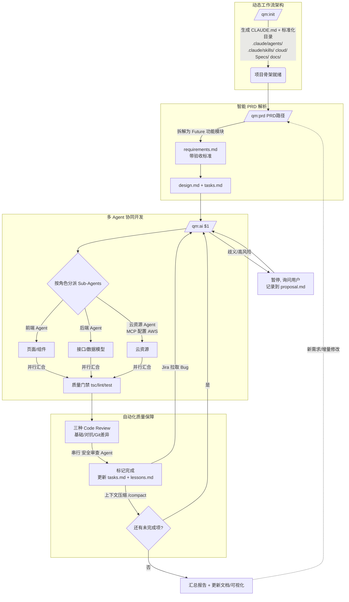
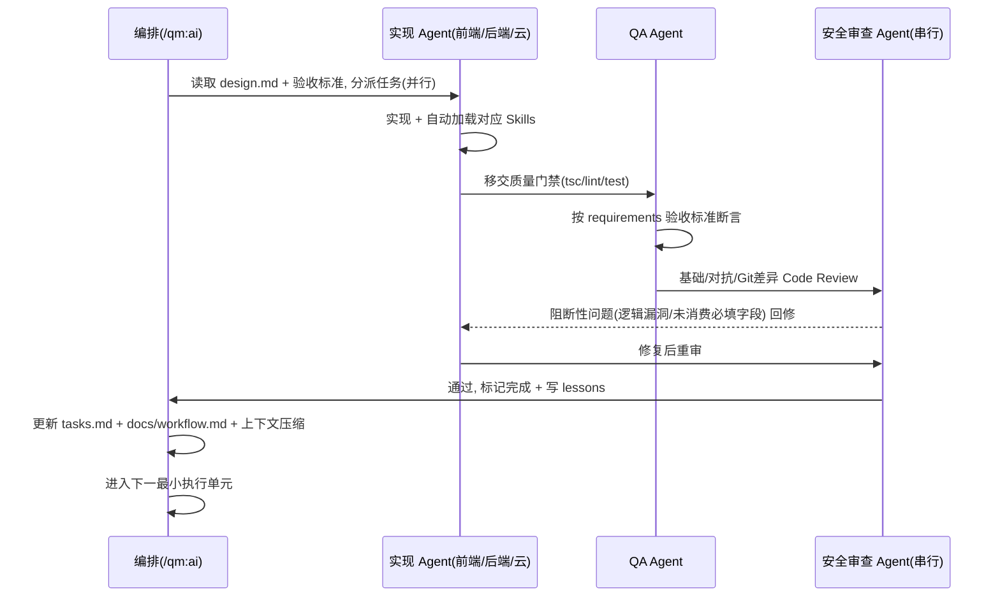
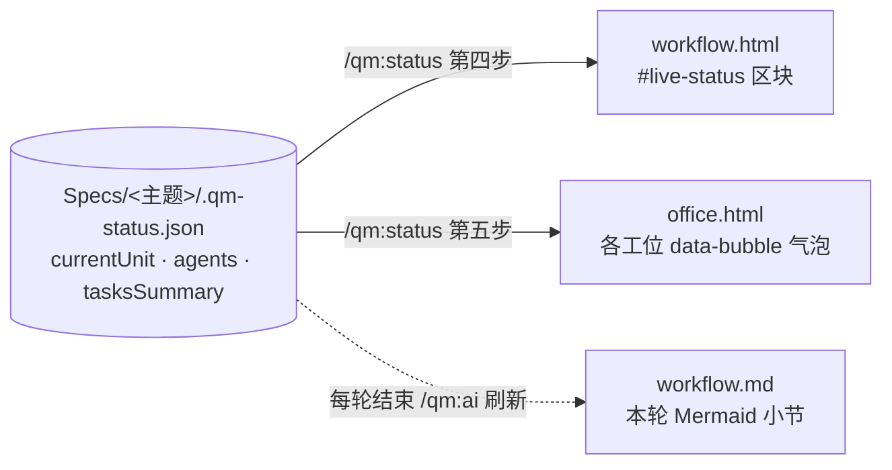
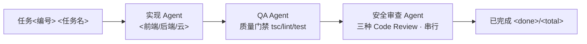

# QM 工作流可视化 · Mermaid 源图（模板）

> 本文件是 `/qm:init` → `/qm:prd` → `/qm:ai` 工作流可视化的 **Mermaid 源图模板**，与同目录的 `workflow.html`（2D 动画看板）、`office.html`（虚拟办公室 · 数字员工）**同源**。
>
> - 在 GitHub / IDE / 任何支持 Mermaid 的 Markdown 渲染器中可直接查看下面的图。
> - 在浏览器中双击 `workflow.html` / `office.html` 可查看动画看板版本。
> - `/qm:ai` 每轮执行后会更新本文件（追加/刷新"本轮"小节，反映当前需求的模块名与任务进度）；若本文件不存在则参照此模板重新创建。
> - `/qm:status` 只读刷新 `workflow.html` 的 `#live-status` 区块与 `office.html` 的工位气泡，不改本文件。

## 总览：命令链路与四大支柱

## 单个最小执行单元（多 Agent 协同）时序

## 实时状态映射（`.qm-status.json` → 看板）

`/qm:ai` 在派发/执行任务前后双写 `Specs/<主题>/.qm-status.json`（覆盖写"当前"状态）；`/qm:status` 据此刷新两张看板：

8 个工位（`agentKey`）与 `.qm-status.json` 的 `agents[].agentKey`、`office.html` 的 `data-agent` 一一对应：

| agentKey | 角色 | 编排/并行/串行 |
|----------|------|----------------|
| `orchestrator` | 编排者（/qm:ai 本体） | 主循环，非被委派 subagent |
| `product` | 产品 Agent | 并行 |
| `design` | 设计 Agent | 并行 |
| `frontend` | 前端 Agent | 并行 |
| `backend` | 后端 Agent | 并行 |
| `qa` | QA Agent | 并行 |
| `cloud` | 云资源 Agent | 并行（实际变更需确认） |
| `security` | 安全审查 Agent | **串行**（合并前介入） |

## 本轮（模板占位 · 由 /qm:ai 每轮替换）

> 下图为占位示例。`/qm:ai` 每轮执行后用当前最小执行单元的真实链路替换本小节（任务编号、承担角色、阶段、完成度）。

