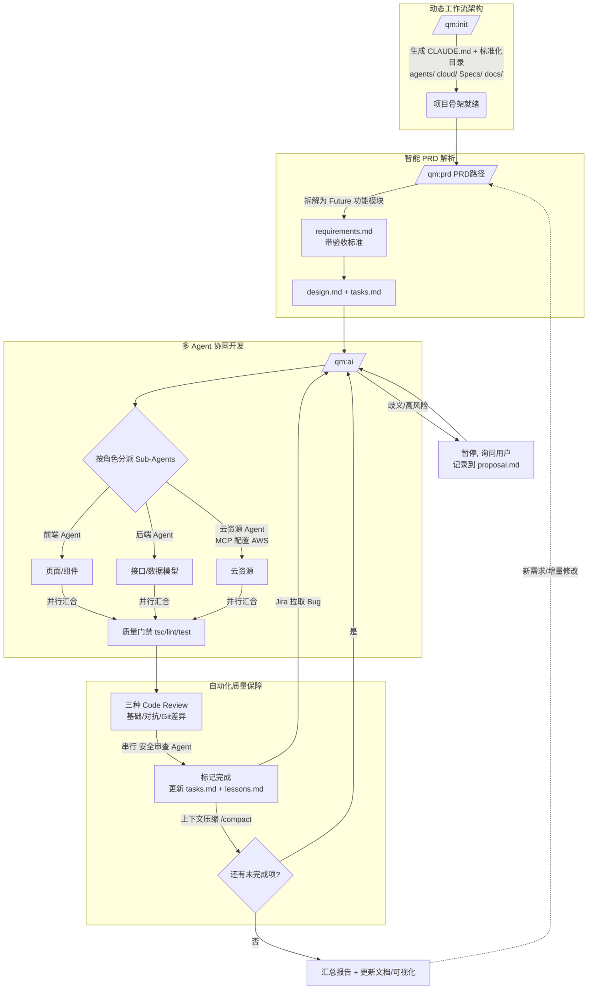
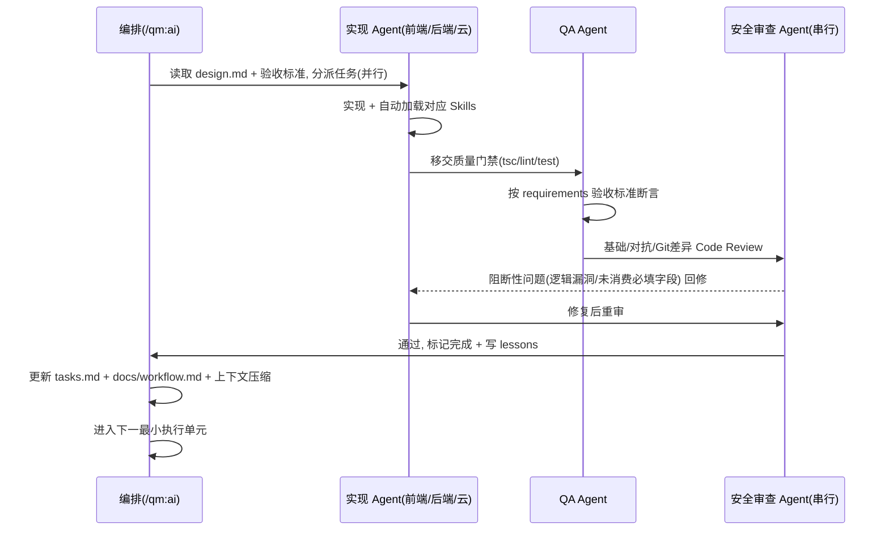
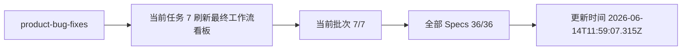

# 阡陌家庭保 · 工作流可视化

<!-- qm:summary:start -->
> 由 `/qm:prd` / `/qm:ai` 每轮执行后更新。当前需求批次：**product-bug-fixes**，任务进度 7/7；全部 Specs 汇总进度 36/36。

## 当前需求 / 任务进度

| 需求主题 | 任务进度 | 状态 |
|---|---:|---|
| create-account-page | 6/6 | 已完成 |
| link-summary | 18/18 | 已完成 |
| login-page-fixes | 5/5 | 已完成 |
| product-bug-fixes | 7/7 | 已完成 |
<!-- qm:summary:end -->

## 总览：命令链路与四大支柱

## 单个最小执行单元（多 Agent 协同）时序

<!-- qm:current-round:start -->
## 本轮（product-bug-fixes）

<!-- qm:current-round:end -->
